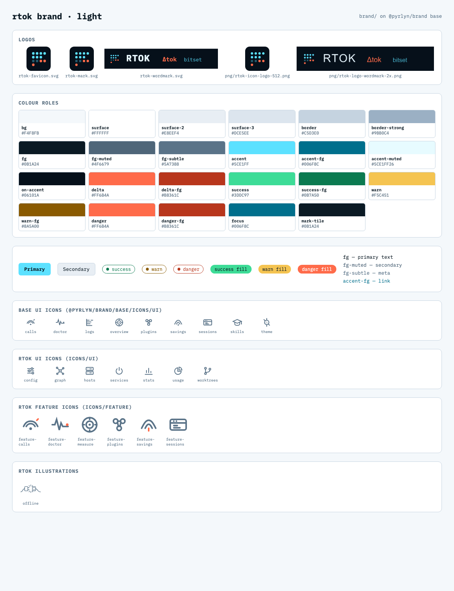
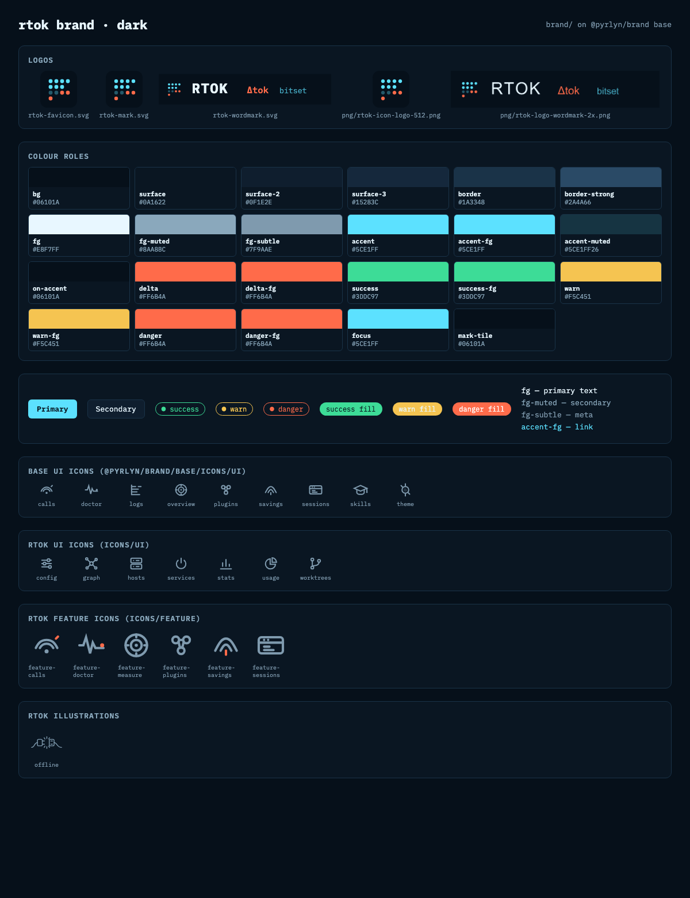

# rtok brand

This folder is the **source of truth for the rtok brand**: logos, colour tokens (Bitset B / Hex Diff, LOCKED), feature and product icons, the brandbook (`DESIGN.md`) and the provenance notes it was built from. It holds only what is
specific to rtok. Everything the Pyrlyn products share (type scale, spacing, radii, sizes,
breakpoints, motion, the semantic colour roles, IBM Plex Mono, the UI icons and the `.pyr-*`
components) is the **Pyrlyn base layer** in [pyrlyn/brand](https://github.com/pyrlyn/brand) `base/`,
and this pack inherits it instead of copying it.

## Inheritance: base from pyrlyn/brand, rtok deltas here

| Layer | Lives in | Provides |
|---|---|---|
| Base | [pyrlyn/brand `base/`](https://github.com/pyrlyn/brand/tree/v0.3.0/base), installed as `@pyrlyn/brand` | tokens (`--pyr-*` scales), the list of colour roles and their fallbacks, fonts, UI icons, components |
| rtok | this folder | the colour roles per theme (`--pyr-bg`, `--pyr-accent` …), rtok's own tokens (`--rtok-*`), logos, feature icons, rtok-only UI icons, the flat `--rtok-*` build |

- `package.json` pins the base: `"@pyrlyn/brand": "github:pyrlyn/brand#v0.3.0"`;
  `package-lock.json` locks it to commit `b42ec5b`.
- `tokens.json` has `"$extends": "@pyrlyn/brand/base/tokens.json"` and only sets rtok's values.
- `node build.mjs` merges the two and writes `dist/tokens.css`, which starts with
  `@import "@pyrlyn/brand/base/tokens.css";` and then sets the roles, plus `dist/tokens.resolved.json`.
- No base file or value is copied into this folder. Roles rtok leaves empty use the base fallback
  (listed in the table below).

**Where to change what.** rtok colours, logos, feature and product icons and `DESIGN.md`: here, in a rtok PR.
Shared tokens, fonts, UI icons, components or the role list: in pyrlyn/brand `base/` first, then bump the
tag in `package.json`, run `npm install` and `node build.mjs` here.

**Origin.** Imported from pyrlyn/brand v0.3.0 `brands/rtok/`. The pack now lives in this repo;
pyrlyn/brand drops `brands/*` in its next release and keeps `base/` unchanged, so the v0.3.0 pin stays
valid until a newer base is needed.

## Use

```sh
cd brand && npm ci          # installs the pinned @pyrlyn/brand into brand/node_modules
npm run build               # regenerate dist/ and the token table below
npm run check               # CI-style check: exit 1 if dist/ or the table is stale
```

In a bundler (Vite, PostCSS, Tailwind v4, esbuild) import the rtok tokens, then the base fonts and,
if wanted, the base components; the bare `@pyrlyn/brand/…` specifiers resolve through
`brand/node_modules`:

```css
@import "<path to>/brand/dist/tokens.css";   /* base tokens + rtok roles (--pyr-*) + --rtok-* */
@import "@pyrlyn/brand/base/fonts.css";      /* IBM Plex Mono */
@import "@pyrlyn/brand/base/components.css"; /* .pyr-btn, .pyr-chip … in rtok colours */
```

Plain HTML has no module resolution: link `brand/node_modules/@pyrlyn/brand/dist/base/tokens.css`
before `brand/dist/tokens.css`. UI icons: `@pyrlyn/brand/base/icons/ui/*.svg`; rtok's own: `icons/ui/` (product UI icons the base does not have) and `icons/feature/` (marketing).

The flat `--rtok-*` build (`dist/legacy/tokens.css`, `tailwind-v4.css`, `components.css` with `.rtok-*`
classes) is generated from the same sources; `dist/legacy/tokens.css` is byte for byte the body of
`web/src/styles/tokens.css` that the web admin ships today.


## Layout

```text
brand/
  package.json, package-lock.json  pins @pyrlyn/brand (base) to v0.3.0
  tokens.json      rtok roles + brand constants + elevation, extends @pyrlyn/brand/base/tokens.json
  build.mjs        -> dist/tokens.css, dist/tokens.resolved.json, dist/legacy/*, the table below
  DESIGN.md        rtok brandbook (deltas only)
  PROVENANCE.md    conflicts resolved, adoption steps per surface, where the provenance snapshots live
  logo/ (+png/)    mark, favicon, wordmark; PNG exports
  icons/feature/   feature icons (+ @2x PNG)
  icons/ui/        rtok-only UI icons (config, graph, hosts, services, sidebar, stats, usage, worktrees)
  illustrations/   offline.svg (web admin empty state)
  examples/        index.html demo page (flat build)
  preview/         light/dark preview PNGs
```

## Tokens

<!-- BEGIN TOKEN TABLE (generated by build.mjs, do not edit) -->
Base: `@pyrlyn/brand` 0.3.0 (`github:pyrlyn/brand#v0.3.0`). AA = lowest contrast of a text role on `bg`, `surface` and
`surface-2` (`on-accent`: on `accent`); ✓ ≥ 4.5:1. Roles without a value use the base fallback shown.

Brand constants: `--rtok-brand-cyan` `#5CE1FF` · `--rtok-brand-coral` `#FF6B4A` · `--rtok-brand-navy` `#06101A` · `--rtok-brand-ink` `#0B1A24` · `--rtok-brand-green` `#3DDC97` · `--rtok-brand-amber` `#F5C451`

| Role | CSS variable | dark (default) | dark AA | light | light AA |
|---|---|---|---|---|---|
| `bg` | `--pyr-bg` | `#06101A` |  | `#F4F8FB` |  |
| `surface` | `--pyr-surface` | `#0A1622` |  | `#FFFFFF` |  |
| `surface-2` | `--pyr-surface-2` | `#0F1E2E` |  | `#E8EEF4` |  |
| `border` | `--pyr-border` | `#1A3348` |  | `#C5D3E0` |  |
| `fg` | `--pyr-fg` | `#E8F7FF` | 15.40 ✓ | `#0B1A24` | 15.13 ✓ |
| `fg-muted` | `--pyr-fg-muted` | `#8AA8BC` | 6.75 ✓ | `#4F6679` | 5.12 ✓ |
| `fg-subtle` | `--pyr-fg-subtle` | `#7F9AAE` | 5.73 ✓ | `#5A7388` | 4.24 ✗ (large text only) |
| `accent` | `--pyr-accent` | `#5CE1FF` |  | `#5CE1FF` |  |
| `accent-muted` | `--pyr-accent-muted` | `#5CE1FF26` |  | `#5CE1FF26` |  |
| `mark-tile` | `--pyr-mark-tile` | `#06101A` |  | `#0B1A24` |  |
| `surface-3` | `--pyr-surface-3` | `#15283C` |  | `#DCE5EE` |  |
| `border-strong` | `--pyr-border-strong` | `#2A4A66` |  | `#9BB0C4` |  |
| `accent-fg` | `--pyr-accent-fg` | `#5CE1FF` | 10.98 ✓ | `#006F8C` | 4.92 ✓ |
| `on-accent` | `--pyr-on-accent` | `#06101A` | 12.46 ✓ | `#06101A` | 12.46 ✓ |
| `delta` | `--pyr-delta` | `#FF6B4A` |  | `#FF6B4A` |  |
| `delta-fg` | `--pyr-delta-fg` | `#FF6B4A` | 5.98 ✓ | `#B8361C` | 5.02 ✓ |
| `danger` | `--pyr-danger` | `#FF6B4A` |  | `#FF6B4A` |  |
| `danger-fg` | `--pyr-danger-fg` | `#FF6B4A` | 5.98 ✓ | `#B8361C` | 5.02 ✓ |
| `success` | `--pyr-success` | `#3DDC97` |  | `#3DDC97` |  |
| `success-fg` | `--pyr-success-fg` | `#3DDC97` | 9.54 ✓ | `#0B7A50` | 4.59 ✓ |
| `warn` | `--pyr-warn` | `#F5C451` |  | `#F5C451` |  |
| `warn-fg` | `--pyr-warn-fg` | `#F5C451` | 10.36 ✓ | `#8A5A00` | 5.07 ✓ |
| `focus` | `--pyr-focus` | `#5CE1FF` |  | `#006F8C` |  |
| `shine` | `--pyr-shine` | `#E8F7FF` |  | `#FFFFFF` |  |
| `selection` | `--pyr-selection` | `#5CE1FF4D` |  | `#5CE1FF4D` |  |
<!-- END TOKEN TABLE -->

## Changes since pyrlyn/brand v0.3.0 `brands/rtok`

- `tokens.json` extends `@pyrlyn/brand/base/tokens.json` (was `../../base/tokens.json`); no colour changed:
  the brand is LOCKED (Hex Diff B: navy `#06101A`, cyan `#5CE1FF`, coral `#FF6B4A`, IBM Plex Mono).
- New `package.json` / `package-lock.json` (base pin), `build.mjs` and `dist/` (the build moved here from
  pyrlyn/brand; output verified identical to pyrlyn/brand v0.3.0 `dist/brands/rtok/` and the legacy flat
  `dist/tokens.css`, `components.css`).
- `icons/ui/`: the 7 UI icons the web admin uses that the base does not have, copied from
  `web/assets/icons/`; `illustrations/offline.svg` from `web/assets/offline.svg`.
- `DESIGN.md`, `examples/index.html`: `../../base` and `../../../dist` paths now point at the package
  (`node_modules/@pyrlyn/brand`) and at `dist/legacy/`.
- `PROVENANCE.md`: the rtok sections of the pyrlyn/brand README (Conflicts, Adopting in each surface,
  Sources), paths adjusted.
- `sources/` (19 MB) and `screenshots/` (29 MB) were not kept: they are provenance and reference
  material, not used by any build. The originals stay in pyrlyn/brand at tag v0.3.0:
  [`brands/rtok/sources/`](https://github.com/pyrlyn/brand/tree/v0.3.0/brands/rtok/sources) and [`brands/rtok/screenshots/`](https://github.com/pyrlyn/brand/tree/v0.3.0/brands/rtok/screenshots).
- `docs/assets/landing-retina/MOVED.txt` points at those snapshots.

## Checked against the product

- `site/static/logo.svg`, `web/assets/logo.svg` = `logo/rtok-mark.svg`; `site/static/favicon.svg` =
  `logo/rtok-favicon.svg`; `site/static/logo-wordmark.svg` = `logo/rtok-wordmark.svg` (byte-identical).
- `web/assets/fonts/*.woff2` = the base IBM Plex Mono files; the 9 shared `web/assets/icons/` = base UI icons.
- `web/src/styles/tokens.css` = `dist/legacy/tokens.css` (same values, only the header line differs).

## Known gaps

- Nothing in rtok imports this folder yet: the web admin still ships its own copies
  (`web/src/styles/tokens.css`, `web/assets/`), the docs site its `site/static/` files. Rewiring them is
  a follow-up (see `PROVENANCE.md`, "Adopting in each surface").
- The provenance snapshots (`sources/`, `screenshots/`) live only in pyrlyn/brand v0.3.0 and are not
  refreshed (e.g. `sources/rtok/docs/site.md` there still has the old listepo URLs). Only `tokens.json`
  and `dist/` are authoritative.

## Preview

| Light | Dark |
|---|---|
|  |  |

## License

Fonts: IBM Plex Mono, SIL Open Font License 1.1, shipped by `@pyrlyn/brand` (`base/fonts/OFL.txt`). The
rtok name, mark and other brand assets have no license grant yet; ask the owner before using them
outside Pyrlyn projects.
